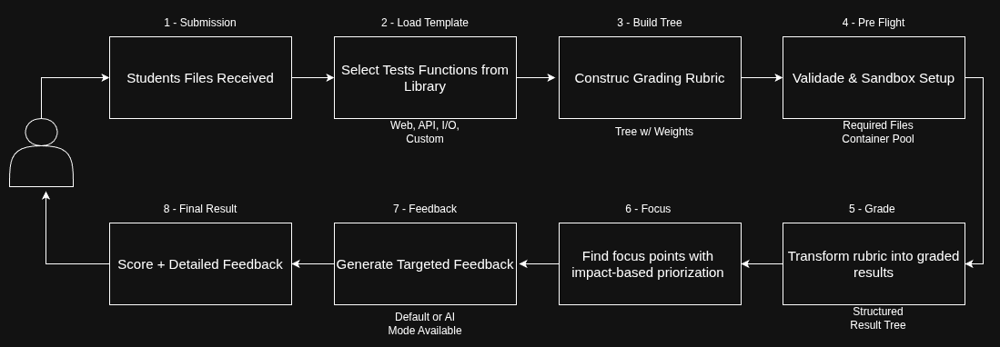

# Autograder

<div align="center">

**A educational-standards-driven autograding tool that transforms assignment grading into an engaging learning experience.**

[](https://www.python.org/downloads/)
[](https://fastapi.tiangolo.com/)
[](https://www.docker.com/)
[](LICENSE)

[Features](#features) • [Architecture](#architecture) • [Quick Start](#quick-start) • [Templates](#grading-templates) • [Pipeline](#pipeline-workflow) • [API](#rest-api) • [GitHub Action](#github-action)

</div>

---

## Overview

The **Autograder** is an advanced educational platform designed to efficiently and accurately grade student submissions using actual pedagogical standards. What makes it stand out is its highly elaborated grading methodology that follows teacher-configured rubrics and generates comprehensive, student-friendly feedback reports.

### Why Autograder?

- **Teacher-Controlled Grading**: Complete control over evaluation criteria with tree-structured rubrics
- **Educational Standards**: Implements proper scoring categories (base, bonus, penalty) with weighted subjects
- **Multiple Assignment Types**: Native support for Web Development, APIs, Command-Line Programs, and Custom Templates
- **Secure Code Execution**: Isolated sandbox environments for safe remote code execution
- **Proven Engagement**: Students treat assignments as iterative learning challenges
- **High Performance**: Warm container pools and pipeline architecture enable rapid grading at scale
- **Intelligent Feedback**: Focus-based feedback generation that highlights the most impactful improvements

## The Grading Pipeline

Every submission flows through a sophisticated pipeline:



Each step is designed to maintain educational standards while providing maximum flexibility.

---

## Features

### For Educators

- **Flexible Grading Rubrics**: Create complex, tree-structured grading criteria with unlimited nesting
  - Base requirements, bonus points, and penalty deductions
  - Subject grouping with custom weights
  - Hierarchical test organization
  
- **One-Time Configuration**: Configure an assignment once, reuse for all submissions
  - Store grading configurations as reusable packages
  - Version control for grading criteria
  - Template library for common assignment types

- **Customizable Feedback**: Control how students receive feedback
  - Default mode: Structured reports with test results
  - AI mode: Intelligent, conversational feedback
  - Focus-based feedback highlighting high-impact improvements

### For Students

- **Detailed Reports**: Understand exactly why you received a certain score
- **Actionable Feedback**: Get specific guidance on what to improve
- **Iterative Learning**: Use feedback to improve and resubmit
- **Transparent Grading**: See the breakdown of scores across all criteria

### For Developers

- **REST API**: Modern FastAPI-based web service
- **GitHub Action**: Seamless integration with GitHub Classroom
- **Extensible Architecture**: Pipeline-based design for easy customization
- **Multiple Languages**: Python, Java, JavaScript/Node.js, C++ support
- **Custom Templates**: Upload your own grading logic for specialized contexts

---

## Architecture

The Autograder uses a **pipeline architecture** that processes submissions through choreographed steps, providing flexibility and excellent performance.

### Core Components

#### Pipeline Pattern

The system is built around **AutograderPipeline** - a stateless, reusable grading workflow.

```python
# Build a pipeline (configuration-driven)
pipeline = build_pipeline(
    template_name="input_output",
    include_feedback=True,
    grading_criteria=criteria_config,
    feedback_config=feedback_settings,
    setup_config={"required_files": ["main.py"]},
    feedback_mode="ai"
)

# Execute pipeline (reusable for any submission)
result = pipeline.run(submission)
```

#### Criteria Tree

Grading criteria are represented as a tree structure mirroring educational rubrics:

```
CriteriaTree
├── Base (weight: 100)
│   ├── Subject: Functionality (weight: 60)
│   │   ├── Test: Correct Output (weight: 100)
│   │   └── Test: Edge Cases (weight: 100)
│   └── Subject: Code Quality (weight: 40)
│       ├── Test: Proper Syntax (weight: 50)
│       └── Test: Good Practices (weight: 50)
├── Bonus (weight: 10)
│   └── Test: Extra Features
└── Penalty (weight: -20)
    └── Test: Late Submission
```

#### Sandbox Management

The **SandboxManager** provides secure, isolated execution environments:

- **Container Pooling**: Pre-started warm containers ready to execute
- **Multi-Language**: Python, Java, JavaScript, and C++ support
- **Automatic Lifecycle**: TTL management, health checks, and cleanup
- **Resource Control**: Memory limits, timeouts, and isolation

#### Template System

Templates provide test functions for different assignment contexts:

- **WebDev**: HTML, CSS, JavaScript validation
- **API Testing**: HTTP request validation
- **Input/Output**: Command-line program testing
- **Custom**: Upload your own test logic

---

## Pipeline Workflow

The pipeline executes these steps in sequence:

1. **Load Template** - Select test functions from the template library
2. **Build Tree** - Construct the grading rubric hierarchy  
3. **Pre-Flight** - Validate requirements and acquire sandbox (if needed)
4. **Grade** - Execute tests and calculate weighted scores
5. **Focus** - Identify high-impact failed tests
6. **Feedback** - Generate student-facing reports
7. **Export** - Send results to external systems (optional)

Each step receives a `PipelineExecution` object, performs its operation, and passes results to the next step.

---

## Grading Templates

### Native Templates

#### 1. Input/Output Template
Tests command-line programs by providing inputs and validating outputs.

| Test Name | Description | Key Parameters |
|-----------|-------------|----------------|
| `expect_output` | Execute program with inputs and verify output | `inputs`, `expected_output`, `program_command` |
| `check_exit_code` | Validate program exit codes | `command`, `expected_exit_code` |
| `timeout_test` | Ensure programs complete within time limits | `command`, `timeout_seconds` |

#### 2. API Testing Template
Makes HTTP requests to student APIs and validates responses.

| Test Name | Description | Key Parameters |
|-----------|-------------|----------------|
| `health_check` | Verify endpoint returns 200 OK | `endpoint` |
| `check_response_json` | Validate JSON response structure | `endpoint`, `expected_key`, `expected_value` |
| `check_status_code` | Test specific HTTP status codes | `endpoint`, `method`, `expected_status` |
| `validate_headers` | Check response headers | `endpoint`, `expected_headers` |

#### 3. Web Development Template
Validates HTML, CSS, and JavaScript files.

| Test Name | Description | Key Parameters |
|-----------|-------------|----------------|
| `has_tag` | Check for HTML tags | `tag`, `required_count` |
| `has_class` | Validate CSS classes (supports wildcards like `col-*`) | `class_names`, `required_count` |
| `check_bootstrap_linked` | Verify framework inclusion | `framework` |
| `has_attribute` | Check element attributes | `tag`, `attribute`, `required_count` |
| `check_css_property` | Validate CSS rules | `selector`, `property`, `expected_value` |

And much more! Check the [WebDev Template Documentation](docs/templates/webdev.md) for the full list of tests.
#### 4. Custom Templates
Upload your own test functions for specialized grading contexts:

```python
from autograder.models.abstract.test_function import TestFunction
from autograder.models.dataclass.test_result import TestResult

class MyCustomTest(TestFunction):
    @property
    def name(self):
        return "my_custom_test"
    
    def execute(self, files, sandbox, **kwargs) -> TestResult:
        # Your custom grading logic
        score = 100 if condition else 0
        return TestResult(
            test_name=self.name,
            score=score,
            report="Test passed!" if score == 100 else "Test failed"
        )
```

---

## Quick Start

### Prerequisites

- Python 3.9+
- Docker and Docker Compose

### Installation

1. **Clone the repository**
```bash
git clone https://github.com/yourusername/autograder.git
cd autograder
```

2. **Install dependencies**
```bash
pip install -r requirements.txt
```

3. **Configure sandbox pools** (edit `sandbox_config.yml`)
```yaml
general:
    # Number of sandboxes to create for each language at startup
    # Development: 2-3, Production: 3-5 depending on expected load
    pool_size: 3

    # Maximum sandboxes per language (prevents resource exhaustion)
    # Production should have higher limits to handle traffic spikes
    scale_limit: 10

    # Seconds before killing idle sandboxes (no running processes)
    # Production: longer timeout to reduce container churn
    idle_timeout: 600

    # Seconds before killing sandboxes with running processes
    # Prevents hanging processes from consuming resources
    running_timeout: 120
```

4. **Build sandbox images**
```bash
make build-sandboxes
```

5. **Start the system**

**As a Web API:**
```bash
docker-compose up
```

**As a GitHub Action:**
See [GitHub Action](#-github-action) section.

---

## REST API

The Autograder provides a FastAPI-based REST API for integration with learning management systems.


**📚 [Complete API Documentation →](docs/API.md)**

Includes endpoints for:
- Creating grading configurations
- Submitting assignments for grading
- Retrieving results

---

## GitHub Action

Seamlessly integrate with GitHub Classroom.

### Usage

Add to your `.github/workflows/classroom.yml`:

```yaml
name: Autograding

on:
  push:
    branches: [ main ]

jobs:
  grade:
    runs-on: ubuntu-latest
    steps:
      - uses: actions/checkout@v2
      
      - name: Run Autograder
        uses: your-org/autograder@v1
        with:
          template_preset: 'input_output'
          feedback-type: 'ai'
          include-feedback: 'true'
          github-token: ${{ secrets.GITHUB_TOKEN }}
          openai_key: ${{ secrets.OPENAI_API_KEY }}
```

### Configuration

**Inputs:**
- `template_preset`: Template to use (`input_output`, `api_testing`, `web_dev`, `custom`)
- `feedback-type`: `default` or `ai`
- `include-feedback`: `true` or `false`
- `custom_template`: JSON template for custom grading
- `openai_key`: Required for AI feedback mode

**Outputs:**
- `result`: Final Score is Sent to Github Classroom!

---

## Useful Contents

**📚 [Complete Data Structures Documentation →](docs/core_structures.md)**

**📚 [Complete Configuration Examples →](docs/configuration_examples.md)**

**📚 [Complete Development Guide →](docs/development.md)**

---

## Use Cases

### Educational Institutions 
- **Automated Homework Grading**: Grade hundreds of submissions consistently
- **Immediate Feedback**: Students get instant results to iterate and improve
- **Scalable Assessment**: Handle courses with large enrollment
- **Fair Grading**: Eliminate human bias with standardized criteria

### Coding Bootcamps
- **Skill Assessment**: Evaluate student progress throughout the program
- **Challenge Labs**: Create engaging, game-like coding challenges
- **Portfolio Building**: Track student improvement over time

### Corporate Training
- **Technical Interviews**: Automated coding challenge grading
- **Employee Onboarding**: Assess technical skills of new hires
- **Skill Validation**: Verify competencies in specific technologies

### Research
- **Educational Research**: Study the impact of feedback on learning
- **Learning Analytics**: Gather data on common student mistakes

---

## Performance

The Autograder is designed for high performance:

- **Warm Containers**: Pre-started sandboxes eliminate cold-start delays
- **Async Processing**: FastAPI enables high concurrency
- **Pipeline Efficiency**: Stateless pipelines can be reused indefinitely
- **Configurable Pools**: Scale sandbox pools based on demand
- **Database Optimization**: Efficient storage of configurations and results

**Typical Performance:**
- Grade submission: 1-3 seconds (with warm sandbox)
- Cold start: 5-8 seconds (first request per language)
- Concurrent submissions: 100+ with proper pool sizing

---

## Contact

For questions, suggestions, or support:

- **Issues**: [GitHub Issues](https://github.com/webtech-network/autograder/issues)
- **Discussions**: [GitHub Discussions](https://github.com/webtech-network/autograder/discussions)
- **Email**: arthurcarvalhorodrigues2409@gmail.com

---

## Acknowledgments

- Built with care for educators and students
- Powered by FastAPI, Docker, and modern Python
- Inspired by the need for fair, consistent, and engaging assessment

---

<div align="center">

**Star this repo if you find it useful!**

Made by educators, for educators

</div>

