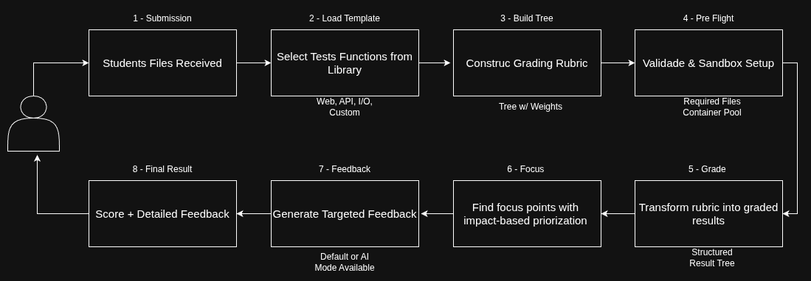

# Autograder

<div align="center">


**An educational-standards-driven autograding tool that transforms assignment grading into an engaging learning experience.**

[](https://www.python.org/downloads/)
[](https://fastapi.tiangolo.com/)
[](https://www.docker.com/)
[](https://github.com/webtech-network/autograder/actions/workflows/pytest.yml)
[](https://github.com/webtech-network/autograder/actions/workflows/pylint.yml)
[](https://github.com/webtech-network/autograder/actions/workflows/validate-docs.yml)
[](LICENSE)

[Features](#features) • [Architecture](#architecture) • [Quick Start](#quick-start) • [Templates](#grading-templates) • [Pipeline](#pipeline-workflow) • [API](#rest-api) • [GitHub Action](#github-action) • [Docs](https://webtech-network.github.io/autograder/) • [Community](#community-standards)

</div>

> [!IMPORTANT]
>
> The Autograder is in active development. New features are being added continuously, and we welcome contributions from the community. We would love to hear your suggestions or feature requests! Don't hesitate on opening an issue on GitHub.

---

## Overview

The **Autograder** is an advanced educational tool designed to efficiently and accurately grade student submissions using actual pedagogical standards. What makes it stand out is its highly elaborated grading methodology that follows teacher-configured rubrics and generates comprehensive, student-friendly feedback reports.

### Why Autograder?

- **Teacher-Controlled Grading**: Complete control over evaluation criteria with tree-structured rubrics
- **Educational Standards**: Implements proper scoring categories (base, bonus, penalty) with weighted subjects
- **Multiple Assignment Types**: Native support for Web Development, APIs, Command-Line Programs, and Custom Templates
- **Secure Code Execution**: Isolated sandbox environments for safe remote code execution
- **Proven Engagement**: Students treat assignments as iterative learning challenges
- **High Performance**: Warm container pools and pipeline architecture enable rapid grading at scale
- **Intelligent Feedback**: Focus-based feedback generation that highlights the most impactful improvements

---

## Try It Now!

**Want to see it in action?** Run the interactive demo:

```bash
make examples-demo
```

Then open **http://localhost:8080** in your browser to:
-  Create grading configurations with visual tree builders
-  Submit code examples in Python, Java, JavaScript, or C++
-  View real-time grading results and score breakdowns
-  Explore all API endpoints interactively

> **Note:** This demo requires the API server to be running. Start it with: `make start-autograder`

---

## The Grading Pipeline

Every submission flows through a sophisticated pipeline:



Each step is designed to maintain educational standards while providing maximum flexibility.

---

## Features

### For Educators

- **Flexible Grading Rubrics**: Create complex, tree-structured grading criteria with unlimited nesting
  - Base requirements, bonus points, and penalty deductions
  - Subject grouping with custom weights
  - Hierarchical test organization
  
- **One-Time Configuration**: Configure an assignment once, reuse for all submissions
  - Store grading configurations as reusable packages
  - Version control for grading criteria
  - Template library for common assignment types

- **Customizable Feedback**: Control how students receive feedback
  - Default mode: Structured reports with test results
  - AI mode: Intelligent, conversational feedback
  - Focus-based feedback highlighting high-impact improvements

### For Students

- **Detailed Reports**: Understand exactly why you received a certain score
- **Actionable Feedback**: Get specific guidance on what to improve
- **Iterative Learning**: Use feedback to improve and resubmit
- **Transparent Grading**: See the breakdown of scores across all criteria

### For Developers

- **REST API**: Modern FastAPI-based web service
- **GitHub Action**: Seamless integration with GitHub Classroom
- **Extensible Architecture**: Pipeline-based design for easy customization
- **Multiple Languages**: Python, Java, JavaScript/Node.js, C++ support
- **Custom Templates**: Upload your own grading logic for specialized contexts

---

## Architecture

The Autograder uses a **pipeline architecture** that processes submissions through choreographed steps, providing flexibility and excellent performance.

### Core Components

#### Pipeline Pattern

The system is built around **AutograderPipeline** - a stateless, reusable grading workflow.

```python
# Build a pipeline (configuration-driven)
pipeline = build_pipeline(
    template_name="input_output",
    include_feedback=True,
    grading_criteria=criteria_config,
    feedback_config=feedback_settings,
    setup_config={"required_files": ["main.py"]},
    feedback_mode="ai"
)

# Execute pipeline (reusable for any submission)
result = pipeline.run(submission)
```

#### Criteria Tree

Grading criteria are represented as a tree structure mirroring educational rubrics:

```
CriteriaTree
├── Base (weight: 100)
│   ├── Subject: Functionality (weight: 60)
│   │   ├── Test: Correct Output (weight: 100)
│   │   └── Test: Edge Cases (weight: 100)
│   └── Subject: Code Quality (weight: 40)
│       ├── Test: Proper Syntax (weight: 50)
│       └── Test: Good Practices (weight: 50)
├── Bonus (weight: 10)
│   └── Test: Extra Features
└── Penalty (weight: -20)
    └── Test: Late Submission
```

#### Sandbox Management

The **SandboxManager** provides secure, isolated execution environments:

- **Container Pooling**: Pre-started warm containers ready to execute
- **Multi-Language**: Python, Java, JavaScript, and C++ support
- **Automatic Lifecycle**: TTL management, health checks, and cleanup
- **Resource Control**: Memory limits, timeouts, and isolation

#### Template Library

Templates provide test functions for different assignment contexts:

- **WebDev**: HTML, CSS, JavaScript validation
- **API Testing**: HTTP request validation
- **Input/Output**: Command-line program testing
- **Custom**: Upload your own test logic

---

## Pipeline Workflow

The pipeline executes these steps in sequence:

1. **Load Template** - Select test functions from the template library
2. **Build Tree** - Construct the grading rubric hierarchy  
3. **Sandbox** - Secure environment acquisition and initial workspace preparation
4. **Pre-Flight** - Validate requirements and execute setup/compilation commands  
5. **Grade** - Execute tests and calculate weighted scores
6. **Focus** - Identify high-impact failed tests
7. **Feedback** - Generate student-friendly reports
8. **Export** - Send results to external systems (optional)

Each step receives a `PipelineExecution` object, performs its operation, and passes results to the next step.

---

## Grading Templates

### Native Templates

#### 1. Input/Output Template
Tests command-line programs by providing inputs and validating outputs.

| Test Name          | Description                                             | Key Parameters                               |
|--------------------|---------------------------------------------------------|----------------------------------------------|
| `expect_output`    | Execute program with inputs and verify output           | `inputs`, `expected_output`, `program_command` |
| `expect_file_artifact` | Execute program and validate a generated output file | `artifact_path`, `expected_content`, `program_command` |
| `dont_fail`        | Validates that a program does not crash on a given input | `inputs`, `program_command`                 |
| `forbidden_import` | Analyzes a file looking for specified libraries imports | `forbidden_imports`        |

#### 2. API Testing Template
Makes HTTP requests to student APIs and validates responses.

| Test Name | Description | Key Parameters |
|-----------|-------------|----------------|
| `health_check` | Verify endpoint returns 200 OK | `endpoint` |
| `check_response_json` | Validate JSON response structure | `endpoint`, `expected_key`, `expected_value` |
| `check_status_code` | Test specific HTTP status codes | `endpoint`, `method`, `expected_status` |
| `validate_headers` | Check response headers | `endpoint`, `expected_headers` |

#### 3. Web Development Template
Validates HTML, CSS, and JavaScript files.

| Test Name | Description | Key Parameters |
|-----------|-------------|----------------|
| `has_tag` | Check for HTML tags | `tag`, `required_count` |
| `has_class` | Validate CSS classes (supports wildcards like `col-*`) | `class_names`, `required_count` |
| `check_bootstrap_linked` | Verify framework inclusion | `framework` |
| `has_attribute` | Check element attributes | `tag`, `attribute`, `required_count` |
| `check_css_property` | Validate CSS rules | `selector`, `property`, `expected_value` |

And much more! Check the [WebDev Template Documentation](docs/templates/web_dev.md) for the full list of tests.
#### 4. Custom Templates
Upload your own test functions for specialized grading contexts:

```python
from autograder.models.abstract.test_function import TestFunction
from autograder.models.dataclass.test_result import TestResult

class MyCustomTest(TestFunction):
    @property
    def name(self):
        return "my_custom_test"
    
    def execute(self, files, sandbox, **kwargs) -> TestResult:
        # Your custom grading logic
        score = 100 if condition else 0
        return TestResult(
            test_name=self.name,
            score=score,
            report="Test passed!" if score == 100 else "Test failed"
        )
```

---

## Quick Start

### Prerequisites

- Python 3.9+
- Docker and Docker Compose

### Installation

1. **Clone the repository**
```bash
git clone https://github.com/webtech-network/autograder.git
cd autograder
```

2. **Install dependencies**
```bash
pip install -r requirements.txt
```

3. **Configure sandbox pools** (edit `sandbox_config.yml`)
```yaml
general:
    # Number of sandboxes to create for each language at startup
    # Development: 2-3, Production: 3-5 depending on expected load
    pool_size: 3

    # Maximum sandboxes per language (prevents resource exhaustion)
    # Production should have higher limits to handle traffic spikes
    scale_limit: 10

    # Seconds before killing idle sandboxes (no running processes)
    # Production: longer timeout to reduce container churn
    idle_timeout: 600

    # Seconds before killing sandboxes with running processes
    # Prevents hanging processes from consuming resources
    running_timeout: 120
```

4. **Build sandbox images**
```bash
make sandbox-build-all
```

5. **Start the system**

**As a Web API:**
```bash
make start-autograder
```

**As a GitHub Action:**
See [GitHub Action](#github-action) section.

---

## REST API

The Autograder provides a FastAPI-based REST API for integration with learning management systems.


**📚 [Complete API Documentation →](https://webtech-network.github.io/autograder/API/)**

Includes endpoints for:
- Creating grading configurations
- Submitting assignments for grading
- Retrieving results

---

## GitHub Action

The Autograder GitHub Action runs the grading pipeline in GitHub Actions and reports results to GitHub Classroom.

### Quick usage

```yaml
name: Autograder
on:
  push:
    branches: [main]
  pull_request:
    branches: [main]
  workflow_dispatch:

jobs:
  grading:
    permissions: write-all
    runs-on: ubuntu-latest
    if: github.actor != 'github-classroom[bot]'
    steps:
      - name: Checkout repository
        uses: actions/checkout@v4
        with:
          path: submission

      - name: Run Autograder
        uses: webtech-network/autograder@main
        with:
          template-preset: "webdev"
          feedback-type: "default"
          include-feedback: "true"
          openai-key: ${{ secrets.ENGINE }}
```

### Learn more

- **Module overview and internals:** [docs/github_action/README.md](docs/github_action/README.md)
- **Configuration reference and troubleshooting:** [docs/github_action/configuration.md](docs/github_action/configuration.md)
- **Reference implementation:** [webtech-network/demo-autograder](https://github.com/webtech-network/demo-autograder)
- **How to adapt the demo to your course:** [docs/github_action/demo-autograder.md](docs/github_action/demo-autograder.md)

---

## Full Documentation

Full documentation available at [GitHub Pages](https://webtech-network.github.io/autograder/)

---

## Use Cases

### Educational Institutions 
- **Automated Homework Grading**: Grade hundreds of submissions consistently
- **Immediate Feedback**: Students get instant results to iterate and improve
- **Scalable Assessment**: Handle courses with large enrollment
- **Fair Grading**: Eliminate human bias with standardized criteria

### Coding Bootcamps
- **Skill Assessment**: Evaluate student progress throughout the program
- **Challenge Labs**: Create engaging, game-like coding challenges
- **Portfolio Building**: Track student improvement over time

### Corporate Training
- **Technical Interviews**: Automated coding challenge grading
- **Employee Onboarding**: Assess technical skills of new hires
- **Skill Validation**: Verify competencies in specific technologies

### Research
- **Educational Research**: Study the impact of feedback on learning
- **Learning Analytics**: Gather data on common student mistakes

---

## Performance

- **Warm Containers**: Pre-started sandboxes eliminate cold-start delays
- **Async Processing**: FastAPI enables high concurrency
- **Configurable Pools**: Scale sandbox pools based on demand

**Typical Performance:**
- Grade submission: 1-3 seconds (with warm sandbox)
- Cold start: 5-8 seconds (first request per language)
- Concurrent submissions: 400+ with proper pool sizing

---

## Community Standards

We are committed to building a welcoming and inclusive community.

- **Code of Conduct**: [CODE_OF_CONDUCT.md](CODE_OF_CONDUCT.md)
- **Contributing Guide**: [CONTRIBUTING.md](CONTRIBUTING.md)
- **Security Policy**: [SECURITY.md](SECURITY.md)
- **Support**: [SUPPORT.md](SUPPORT.md)
- **Issue Templates**: [`.github/ISSUE_TEMPLATE`](.github/ISSUE_TEMPLATE)
- **PR Template**: [`.github/pull_request_template.md`](.github/pull_request_template.md)

---

## Contact

For questions, suggestions, or support:

- **Issues**: [GitHub Issues](https://github.com/webtech-network/autograder/issues)
- **Discussions**: [GitHub Discussions](https://github.com/webtech-network/autograder/discussions)
- **Email**: arthurcarvalhorodrigues2409@gmail.com

---

<div align="center">

**Star this repo if you find it useful!**

Made by educators, for educators

</div>
